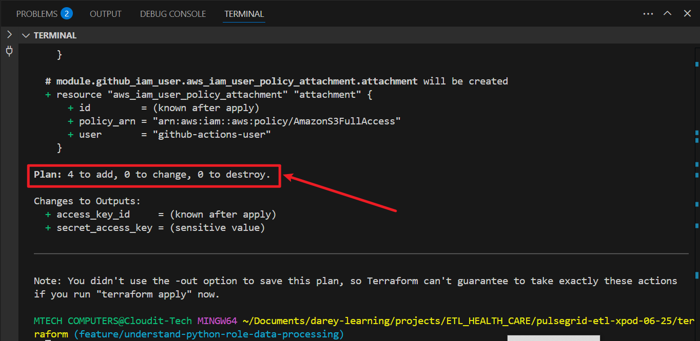

# Understand Python's Role in Data Processing

## Purpose

Analyze and demonstrate how Python automates healthcare data processing and integrates with AWS services.

**What I Did**

- Researched healthcare data automation needs (EHRs, vitals, labs).

- Found Python excels in: data extraction, cleaning (pandas), automation, and AWS integration (boto3).

- Prepared to generate synthetic patient data, clean it, and upload to S3.

## Technologies Used:

- `Terraform` – Infrastructure provisioning and GitHub Actions secret management

- `Python` – Data generation, cleaning, and S3 upload

- `GitHub Actions` – CI/CD pipeline execution

- `AWS` – IAM for credentials, S3 for data storage

## Project Directory Structure

```
project-root/
├── terraform/
│   ├── backend.tf                   # Remote state config
│   ├── main.tf                      # Call IAM module, push secrets to GitHub
│   ├── outputs.tf                   # Output IAM access keys
│   ├── variables.tf                 # Inputs: user name, policy, GitHub repo
│
├── modules/
│   └── aws_iam_user/
│       ├── main.tf                  # Creates IAM user, access keys, attach policy
│       ├── outputs.tf               # Outputs access key and secret key
│       └── variables.tf             # Variables for user name and policy
│
├── scripts/
│   ├── synthetic_health_records.py  # Step 3: Generate & clean synthetic patient data
│   └── push_csv_to_s3.py            # Step 4: Upload cleaned data to S3
│
├── .github/
│   └── workflows/
│       └── deploy.yml               # GitHub Actions CI/CD pipeline
```

## Step 2: Terraform Setup with IAM Module and GitHub Secrets Integration

**Purpose**

Provision IAM user with access keys, attach policies, and push credentials securely as GitHub repository secrets using Terraform.

**What I Did**

**File: `terraform/providers.tf`**

```
provider "aws" {
  region = var.aws_region
}

terraform {
  required_providers {
    github = {
      source  = "integrations/github"
      version = "6.6.0"
    }
  }
}

provider "github" {
  token = var.github_token
  owner = var.github_owner
}
```

**File: `terraform/backend.tf`**

Configures the backend to store Terraform state in a remote S3 bucket.
```
# Configure Terraform backend with existing S3 bucket for remote state
terraform {
  backend "s3" {
    bucket  = "xterns-pod-06-25-dev-backend"
    key     = "terraform.tfstate"
    region  = "us-east-1"
    encrypt = true
  }
}
```

**File: `terraform/variables.tf`**

Defines input variables for IAM user name, policy ARN, and GitHub repo

```
# IAM user name to create for GitHub Actions
variable "iam_user_name" {
  type        = string
  description = "IAM user for GitHub Actions"
}

# IAM policy ARN to attach to the user (default S3 full access)
variable "policy_arn" {
  type        = string
  default     = "arn:aws:iam::aws:policy/AmazonS3FullAccess"
  description = "Policy ARN to attach to IAM user"
}

# GitHub repository full name (e.g., your-org/repo-name)
variable "github_repo" {
  type        = string
  description = "GitHub repository where secrets will be stored"
}

variable "github_owner" {
  description = "GitHub username or organization"
  type        = string
}

variable "github_token" {
  description = "GitHub Personal Access Token"
  type        = string
  sensitive   = true
}
```

**File: `terraform/main.tf`**

Calls IAM module and pushes access credentials to GitHub secrets.
```
# Call IAM module and push credentials to GitHub Secrets.
module "github_iam_user" {
  source        = "./modules/aws_iam_user"
  iam_user_name = var.iam_user_name
  policy_arn    = var.policy_arn
}

# Compose full GitHub repository name as owner/repo
locals {
  github_repository_full_name = "${var.github_owner}/${var.github_repo}"
}

# Store AWS Access Key ID as GitHub Actions secret
resource "github_actions_secret" "aws_access_key_id" {
  # repository      = local.github_repository_full_name
  repository      = var.github_repo
  secret_name     = "AWS_ACCESS_KEY_ID"
  plaintext_value = module.github_iam_user.access_key_id
}

# Store AWS Secret Access Key as GitHub Actions secret
resource "github_actions_secret" "aws_secret_access_key" {
  # repository      = local.github_repository_full_name
  repository      = var.github_repo
  secret_name     = "AWS_SECRET_ACCESS_KEY"
  plaintext_value = module.github_iam_user.secret_access_key
}
```

 ## IAM Module (modules/aws_iam_user/)

**File: `modules/aws_iam_user/main.tf`**

Creates IAM user, generates access keys, attaches a policy.

```
# Understand Python's Role in Data Processing==========================
# Create IAM user for GitHub Actions
resource "aws_iam_user" "user" {
  name = var.iam_user_name
}

# Create access keys for the IAM user
resource "aws_iam_access_key" "key" {
  user = aws_iam_user.user.name
}

resource "aws_iam_policy" "custom_policy" {
  name        = "TerraformGitHubAccessPolicy"
  description = "Grants GitHub Actions user required access to AWS resources"

  policy = jsonencode({
    Version = "2012-10-17",
    Statement = [
      {
        Effect = "Allow",
        Action = [
          # IAM
          "iam:GetUser",
          "iam:GetPolicy",
          "iam:GetPolicyVersion",

          # S3
          "s3:*",

          # KMS
          "kms:DescribeKey",
          "kms:GetKeyPolicy",
          "kms:GetKeyRotationStatus",
          "kms:ListResourceTags",
          "kms:Decrypt",
          "kms:Encrypt",
          "kms:GenerateDataKey"
        ],
        Resource = "*"
      }
    ]
  })
}

# Attach the specified IAM policy to the IAM user
resource "aws_iam_user_policy_attachment" "attachment" {
  user       = aws_iam_user.user.name
  policy_arn = aws_iam_policy.custom_policy.arn
}
```

**File: `modules/aws_iam_user/variables.tf`**

Accepts user name and policy ARN as module inputs.
```
variable "iam_user_name" {
  type        = string
  description = "Name of the IAM user to create"
}

variable "policy_arn" {
  type        = string
  description = "IAM policy ARN to attach to the user"
  default     = "arn:aws:iam::aws:policy/AmazonS3FullAccess"
}
```

**File: `modules/aws_iam_user/outputs.tf`**

Exposes IAM user access credentials to the root module.

```
# Output IAM access key ID
output "access_key_id" {
  value = aws_iam_access_key.key.id
}

# Output IAM secret access key (sensitive)
output "secret_access_key" {
  value     = aws_iam_access_key.key.secret
  sensitive = true
}
```

## Step 3: Generate and Clean Sample Patient Data with Python

**Purpose**

Create synthetic healthcare patient data (20 records), clean it, then upload to S3.

**What I Did**

Used `faker` to generate data, `pandas` to clean, and saved as CSV.

## Python Scripts (scripts/)

**`scripts/synthetic_health_records.py`**

Generates and cleans synthetic patient data using `faker` and `pandas`.

```
import pandas as pd
from faker import Faker

# Initialize Faker and apply seed for reproducibility
fake = Faker()
Faker.seed(1234)

# Generate 20 patient records
data = [{
    "patient_id": i,
    "name": fake.name(),
    "age": fake.random_int(min=1, max=90),
    "email": fake.email(),
    "phone": fake.phone_number(),
    "diagnosis": fake.word()
} for i in range(1, 21)]

# Create DataFrame
df = pd.DataFrame(data)

# Simple cleaning: drop duplicates
df.drop_duplicates(inplace=True)

# Save cleaned data locally
df.to_csv("scripts/cleaned_patients.csv", index=False)
```

## Step 4: Upload Cleaned Data to S3

**Purpose**

**What I Did**

Send cleaned CSV data to the production S3 bucket using AWS SDK in Python.

**`scripts/push_csv_to_s3.py`**

Reads cleaned CSV and uploads it to the production S3 bucket using `boto3`.

```
import boto3
import os

# AWS credentials from GitHub Actions secrets
aws_access_key = os.getenv("AWS_ACCESS_KEY_ID")
aws_secret_key = os.getenv("AWS_SECRET_ACCESS_KEY")

# Upload config
bucket_name = "xpod-06-25-prod-clean-data"
file_path = "scripts/cleaned_patients.csv"
object_key = "cleaned_patients.csv"

# S3 session
session = boto3.Session(
    aws_access_key_id=aws_access_key,
    aws_secret_access_key=aws_secret_key,
)

s3 = session.resource('s3')
s3.Bucket(bucket_name).upload_file(file_path, object_key)

print(f"✔️ Uploaded {file_path} to S3 bucket: {bucket_name}/{object_key}")
```

## Step 5: GitHub Actions CI/CD Workflow

**Purpose**

Run Terraform and Python scripts on push to automate provisioning and data pipeline.

**What I Did**

**Create` .github/workflows/synthetic_health_records.yml`:**

Automates Terraform apply + Python data pipeline when changes are pushed to any branch.
```
name: Terraform & Python CI/CD

on:
  push:
    branches:
      - '**'  # Trigger on push to any branch

env:
  AWS_ACCESS_KEY_ID: ${{ secrets.AWS_ACCESS_KEY_ID }}
  AWS_SECRET_ACCESS_KEY: ${{ secrets.AWS_SECRET_ACCESS_KEY }}
  TF_VAR_github_token: ${{ secrets.TF_VAR_GITHUB_TOKEN }}

jobs:
  deploy:
    runs-on: ubuntu-latest

    steps:
    - name: Checkout code
      uses: actions/checkout@v3

    - name: Setup Terraform
      uses: hashicorp/setup-terraform@v2
      with:
        terraform_version: 1.6.0

    - name: Terraform Init & Apply
      run: |
        cd terraform
        terraform init
        terraform apply -auto-approve

    - name: Setup Python
      uses: actions/setup-python@v4
      with:
        python-version: "3.11"

    - name: Install dependencies
      run: pip install pandas boto3 faker

    - name: Generate & Clean Patient Data
      run: python scripts/synthetic_health_records.py

    - name: Upload Cleaned Data to S3
      run: python scripts/push_csv_to_s3.py
```

This structure meets the following:

- Terraform provisions IAM + GitHub integration.

- Python handles real-world synthetic data creation and cleaning.

- GitHub Actions automates your entire flow (IaC + DataOps).

## How to Use:

1. Export GitHub PAT to Terraform
   
   ```
   export TF_VAR_github_token="ghp_yourPersonalAccessToken"
   ```

2. Run Terraform

   ```
   terraform init
   export TF_VAR_env="dev"
   ```
   

   ```
   terraform plan
   ```
   
  

   ```
   terraform apply -auto-approve
   ```
### Error:


The error message:

```bash
Error: creating IAM User (github-actions-user): ... EntityAlreadyExists: User with name github-actions-user already exists.
```
means **Terraform is trying to create an IAM user that already exists in your AWS account.**

**How I fixed it:**

Import the existing IAM user into Terraform state

The IAM user `github-actions-user` was created by a different Terraform configuration in a previous project. I need to import it into the current setup so Terraform can manage it without attempting to recreate it.

Ran this command in my Terraform root directory:

```
terraform import module.github_iam_user.aws_iam_user.user github-actions-user
```


This tells Terraform: "Hey, that user exists already, just start managing it."

After this, run:

```
terraform plan
```



Why terraform plan shows fewer resources 4 instead of 5:

- Previously, Terraform tried to create the IAM user plus any related resources (e.g., policy attachments).

- Since the IAM user is now already imported and managed, it's not shown as a new resource to be created anymore.
- So terraform plan only shows the remaining resources that still need to be created.

I can now go ahead and run:

```
terraform apply -auto-approve
```


## GitHub Actions will:

- ### Create IAM user and access keys


- ### Push AWS credentials as GitHub Secrets

  

- ### Run Python script to generate & upload cleaned patient data

  

  

  

- ### Downloaded cleaned data from S3 bucket

  

## Key Components:

**Terraform**

- Used to import and manage an existing IAM user (`github-actions-user`)

- Automatically pushed IAM credentials to GitHub Secrets

- Connected to existing S3 buckets (`xpod-06-25-prod-clean-data`)

**Python Scripts**

- `synthetic_health_records.py`: Generated **20** synthetic patient records and cleaned the data

- `push_csv_to_s3.py`: Uploaded the cleaned CSV to the existing production S3 bucket

**GitHub Actions**

- CI/CD pipeline triggered on push to any branch

- Executed the full workflow: **Terraform provisioning → Python data processing → S3 upload**

## Final Outcome:

- All Terraform resources applied successfully

- IAM user conflict resolved via terraform import

- GitHub Actions secrets were created programmatically

- Python scripts ran as part of the CI/CD workflow

- Cleaned healthcare data was uploaded to the correct S3 bucket

- CI/CD pipeline completed successfully and automatically